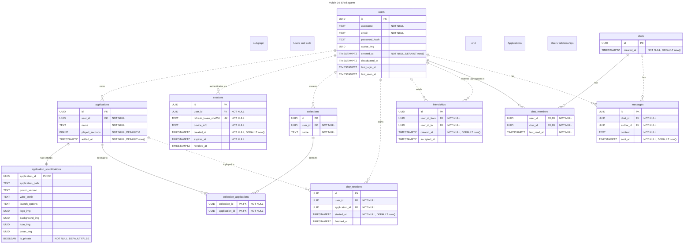

```mermaid
---
title: Vulpix DB ER diagarm
---
erDiagram
    subgraph "Users and auth"
    users {
        UUID id PK
        TEXT username "NOT NULL"
        TEXT email "NOT NULL"
        TEXT password_hash
        UUID avatar_img
        TIMESTAMPTZ created_at "NOT NULL, DEFAULT now()"
        TIMESTAMPTZ deactivated_at
        TIMESTAMPTZ last_login_at
        TIMESTAMPTZ last_seen_at
    }

    sessions {
        UUID id PK
        UUID user_id FK "NOT NULL"
        TEXT refresh_token_sha256 UK "NOT NULL"
        TEXT device_info "NOT NULL"
        TIMESTAMPTZ created_at "NOT NULL, DEFAULT now()"
        TIMESTAMPTZ expires_at "NOT NULL"
        TIMESTAMPTZ revoked_at
    }
    end

    subgraph "Applications"
    applications {
        UUID id PK
        UUID user_id FK "NOT NULL"
        TEXT name "NOT NULL"
        BIGINT played_seconds "NOT NULL, DEFAULT 0"
        TIMESTAMPTZ added_at "NOT NULL, DEFAULT now()"
    }

    application_specifications {
        UUID application_id PK, FK
        TEXT application_path
        TEXT proton_version
        TEXT wine_prefix
        TEXT launch_options
        UUID logo_img
        UUID background_img
        UUID icon_img
        UUID cover_img
        BOOLEAN is_private "NOT NULL, DEFAULT FALSE"
    }

    collections {
        UUID id PK
        UUID user_id FK "NOT NULL"
        TEXT name "NOT NULL"
    }

    collection_applications {
        UUID collection_id PK, FK "NOT NULL"
        UUID application_id PK, FK "NOT NULL"
    }

    play_sessions {
        UUID id PK
        UUID user_id FK "NOT NULL"
        UUID application_id FK "NOT NULL"
        TIMESTAMPTZ started_at "NOT NULL, DEFAULT now()"
        TIMESTAMPTZ finished_at
    }
    end

    subgraph "Users' relationships"
    friendships {
        UUID id PK
        UUID user_id_from FK "NOT NULL"
        UUID user_id_to FK "NOT NULL"
        TIMESTAMPTZ created_at "NOT NULL, DEFAULT now()"
        TIMESTAMPTZ accepted_at
    }

    chats {
        UUID id PK
        TIMESTAMPTZ created_at "NOT NULL, DEFAULT now()"
    }
    
    chat_members {
        UUID user_id PK, FK "NOT NULL"
        UUID chat_id PK, FK "NOT NULL"
        TIMESTAMPTZ last_read_at "NOT NULL"
    }

    messages {
        UUID id PK
        UUID chat_id FK "NOT NULL"
        UUID author_id FK "NOT NULL"
        TEXT content "NOT NULL"
        TIMESTAMPTZ sent_at "NOT NULL, DEFAULT now()"
    }
    end

    users ||..o{ applications : "owns"
    applications ||--|| application_specifications : "has settings"
    users ||..o{ sessions : "authenticates via"
    users ||..o{ collections : "creates"
    collections ||--o{ collection_applications : "contains"
    applications ||--o{ collection_applications : "belongs to"
    applications ||..o{ play_sessions : "is played in"
    users ||..o{ play_sessions : "starts"
    users ||..o{ friendships : "sends"
    users ||..o{ friendships : "receives"
    users ||--o{ chat_members : "participates in"
    chats ||--o{ chat_members : "has"
    chats ||..o{ messages : "has"
    users ||..o{ messages : "has"
```

